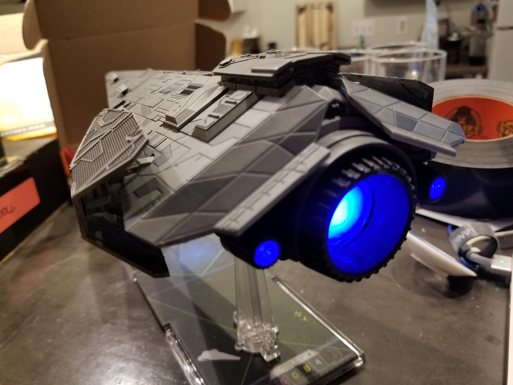
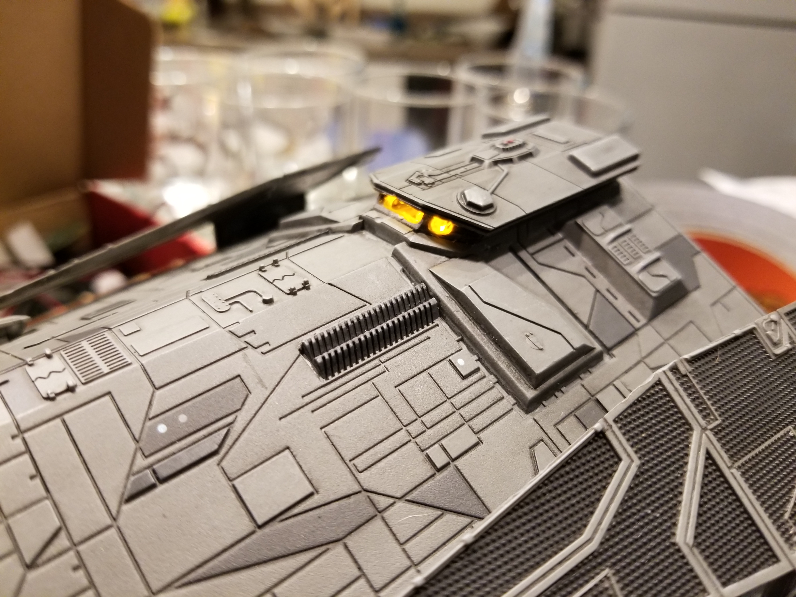
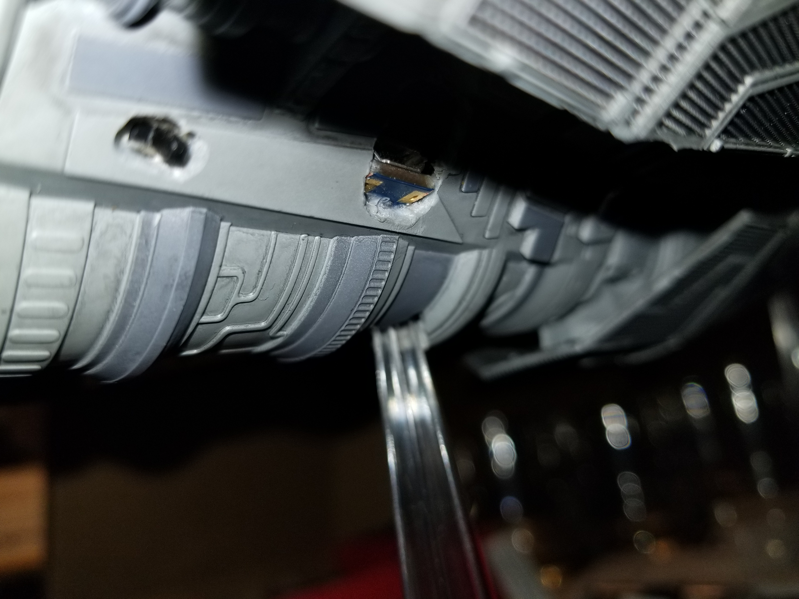
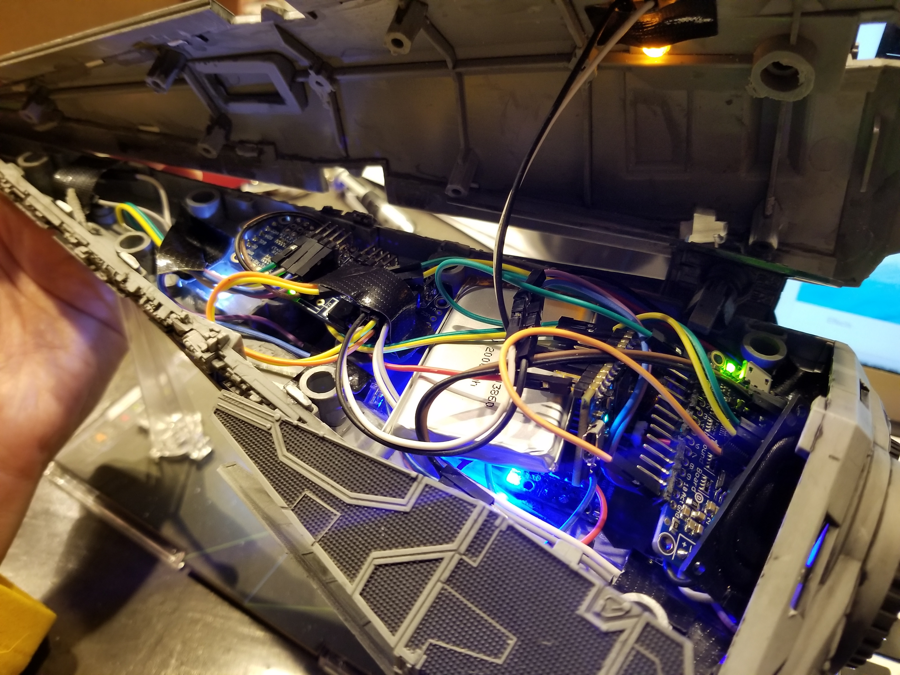

# X-Wing Miniatures Imperial Raider with Lights and Sound Effects

This code repository contains source files and circuit schematics for adding light and sound effects to an X-Wing Miniatures Imperial Raider, controlled with an app through WiFi.

DISCLAIMER: I take no responsibility for your Imperial Raider turning into an expensive heap of broken plastic. It was *very* touch and go for a lot of this project.

### Features

- Controlled via app!
- Bridge lights up when it is connected to the cloud:

  

- USB charging

  

For a full demonstration of the project being controlled by the app, see the [video on YouTube](https://youtu.be/tVzzycC0O-s).

### Requirements

The total budget ran me more than $130. This is not including any hardware that I used during prototypes, or tools that I already had. Therefore, the good news is that if you ruin a perfectly good Imperial Raider, it still accounts for less than half your total budget. The bad news is that this is a pretty expensive project so don't tell your significant other.

I constructed this using the following breakout boards:

- [Particle.io Photon without headers](https://www.adafruit.com/product/2722)
- [Adafruit Audio FX Sound Board + 2x2W Amp](https://www.adafruit.com/product/2217)
- [Adafruit 16-Channel 12-bit PWM/Servo Driver](https://www.adafruit.com/product/815)
- [Adafruit PowerBoost 1000C](https://www.adafruit.com/product/2465)
- [2000 mAh Battery](https://www.adafruit.com/product/2011)

Additional components needed:

- [Slide Switch](https://www.adafruit.com/product/805)
- A piece of positive/negative supply rail from an [Adafruit Perma Proto board](https://www.adafruit.com/product/1608)
- An 8 Ohm 2W speaker from a [PiMoroni Speaker pHat](https://www.adafruit.com/product/3401)
- [Right angle headers](https://www.adafruit.com/product/1540)
- Assorted LEDs
- Jumper Wires (Get a variety of short lengths and don't buy cheap ones - you will be frustrated.)
- Super glue and gorilla tape
- A piece of a milk jug to use as an LED diffuser

Tools needed:

- Soldering iron/solder
- Dremel with [Engraving Kit](https://www.amazon.com/dp/B00IGITT8C/ref=asc_df_B00IGITT8C5382567/?tag=hyprod-20&creative=395009&creativeASIN=B00IGITT8C&linkCode=df0&hvadid=241955516116&hvpos=1o1&hvnetw=g&hvrand=17791976209422715378&hvpone=&hvptwo=&hvqmt=&hvdev=c&hvdvcmdl=&hvlocint=&hvlocphy=9028321&hvtargid=pla-409309069868)
- Drill

Skills needed:

- A little bit of coding skill
- The ability to use a command line terminal and not be afraid of it
- Rudimentary knowledge of circuits
- Minor soldering skills
- A very steady hand for cutting through your Imperial Raider miniature and carving out some holes

### In this repo

- [A Fritzing diagram of the component connections](./fritzing)
- [Firmware source for the Particle.io Photon](./firmware)
- [Ionic Framework source code for the control app](./ionic_app)

### Brief summary

- Configure the Photon for all of your WiFi access points that will use. Mine is configured to use my home WiFi as well as my phone's cellular hotspot.
- Load some sound effects onto the Sound FX board. I loaded the tracks as WAV files using the Txx.wav file naming scheme, and the firmware is built to play the effects by track number.
- Solder on the right angle headers. You will have to conserve space to make everything fit - the interior of the Imperial Raider is deceptively short, so right angle headers are a must. You may even wish to have the headers point in unusual directions to match where your components will go. Some of my headers go toward the interior of the breakout boards, or are mounted on their undersides.
- Flash the firmware to the Photon, build the control app and test everything.
- Disassemble your Imperial Raider... carefully. (I made a few mistakes.) The best way to do this is to put it in the freezer until the superglue becomes brittle - a couple days. You can pop the side solar panel struts away from the body (do not pull on the panels!) These struts hold in the top of the raider. Failing to remove the solar panels via the struts means that you will damage the top of the raider when you remove it. (Which is what I did...) The top actually has a plastic tab that the struts pass through before being glued to the bottom. After removing the struts, you should attempt to pop the tabs holding the two halves together by pressing on them with a screwdriver. (I did not - I just broke the tabs.) The top should break free after this.
- Modify the lower body. I cut a hole for the USB charging port to fit through from the AdaFruit PowerBoost 1000C (which I also modified by removing some of the PCB around the USB port) and a place for the slide switch to fit. I also removed some extra plastic and posts on the inside of the bottom half to get some extra space for electronics. I drilled out the side engines and additional holes for the spotlight and firing arc LEDs. Finally, I cut away the center of the main engine and replaced it with a piece of a milk jug to act as a diffuser for the LEDs.
- Install the LEDs. Judicious amounts of gorilla tape hold most of my LEDs in place. If you wish to install the bridge LED, you can cut through the windows of the bridge until you reach the hollow inside. (This is where I really needed the small engraving bits from the Dremel Engraving Kit.) The LED actually comes up from the bottom of the bridge through a separate hole.
- Make everything fit!
