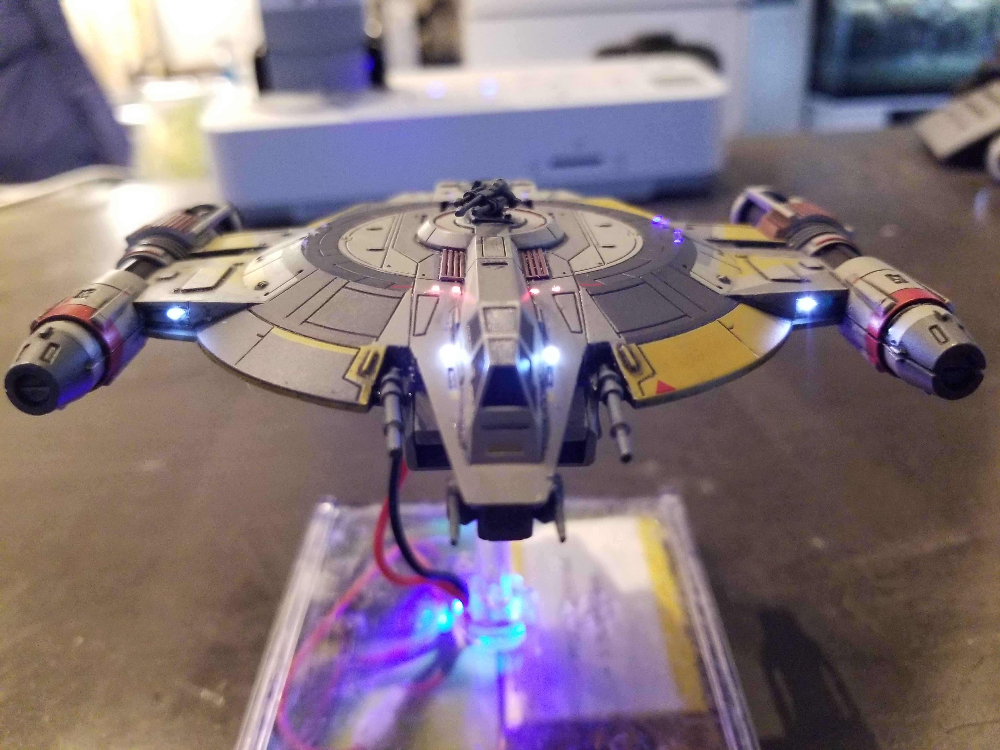
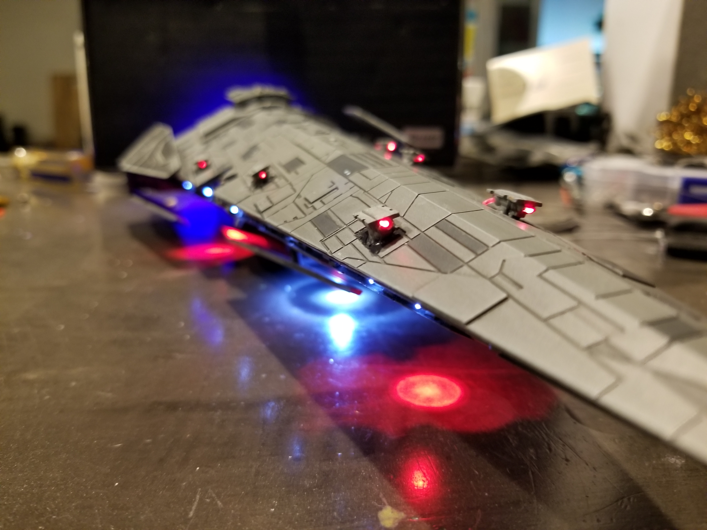

# BLuE Squadron Code Repository

This repository contains firmware, schematics and a mobile application for everything (and more) in the [BLuE Squadron YouTube Channel](https://www.youtube.com/channel/UCS0pc1Q1biHI0U242yoE72w).

### Lancer Class Pursuit Craft

Featuring firing arc selector via turret push-button.

- [Files](./lancer)
- [Full build on YouTube](https://www.youtube.com/playlist?list=PLwzfkHwR75l8_vtVdyYZ4Rbb73pEVnaKY)

### Millenium Falcon

- [Files](./millenium_falcon)

### VT-49 Decimator

- [Files](./decimator)

### Tantive IV

- [Files](./tantive)

### Imperial Raider

- [Files](./imperial_raider)