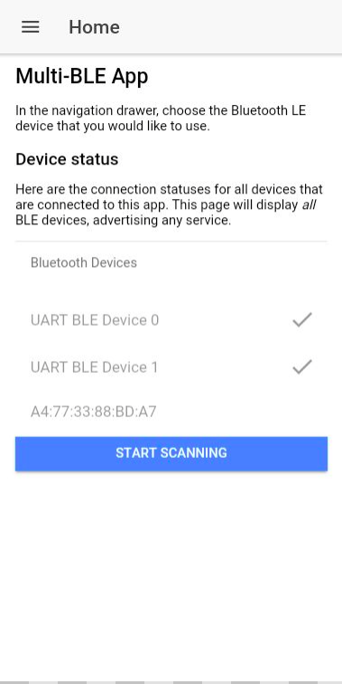
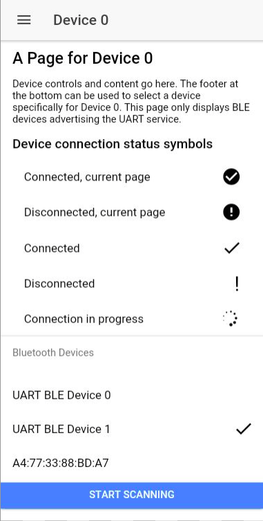

# Ionic Multi-BLE App

This boilerplate for an Ionic Framework app allows simultaneous connections to multiple Bluetooth LE devices, each on a separate page. Each page remembers the last device it connected to. This app was tested on a Samsung Galaxy S8 (Android) with devices that are open Bluetooth LE devices (no pairing, no security).

Home Page                  | Device Page
:-------------------------:|:-------------------------:
 | 

### Building This Project

Install NodeJS and Ionic Framework. Inside of the project directory, initialize it with `ionic --confirm` and add your platform with `ionic cordova platform add [platform]`.

### Components

There are several components you can customize for your specific application.

##### [`./src/app/app.component.ts`](./src/app/app.component.ts)

You can add additional device pages by modifying the `devices` array in the constructor.

```
   constructor(public platform: Platform, public statusBar: StatusBar, public splashScreen: SplashScreen) {
     this.initializeApp();

     // used for an example of ngFor and navigation
     this.devices = [
       'Device 0',
       'Device 1',
     ];

   }
```

Each page adds an additional page to the navigation sidebar. When clicked, it will load `DevicePage` and pass the specific page name to it.

##### [`DevicePage` (`./src/pages/device/`)](./src/pages/device/)

The `DevicePage` component is a boilerplate for a page that interacts with a Bluetooth LE device. You can add UI elements specific to your application here. One `DevicePage` component appears as multiple pages in the navigation sidebar. When selected in the navigation sidebar, `DevicePage` receives the name of the page that was selected and loads the last Bluetooth LE device associated with the page name. The Bluetooth device's ID is stored in the `device_id` variable.

##### [`<blelist>` component (`./src/components/blelist`)](./src/pages/blelist/)

This component allows you to connect to Bluetooth LE devices.

*Inputs*:

- `[selectedDevice]: string` - when set, the list will treat the given device ID string as the "selected device" for this instance of `<blelist>`, with connected and disconnected status icons on black circles. This is used to distinguish devices bound to the current `DevicePage` from devices bound to other pages.
- `[disableSelect]: boolean` - disables device selection, when you only want the list to display connection status but not initiate new connections.
- `[services]: string[]` - when set to a list of BLE service UUIDs, causes any scanning to scan for devices with those specific services.

*Outputs*:

- `(deviceSelected): void(string)` - will invoke a callback that sends a BLE device ID selected by a user.

*Properties*:

- `public selectedDevice: string` - programmatic equivalent of `[selectedDevice]`

##### [`MultiBLEProvider` (`./src/providers/multible/multible.ts`)](./src/providers/multible/multible.ts)

This provider abstracts the [`@ionic-native/ble`](https://ionicframework.com/docs/native/ble/) package and maintains device status for multiple Bluetooth LE devices. In addition, it stores connected devices and attempts to reconnect to them upon initiation or scan. 

*Properties*:

- `public devices: any` - A dictionary of all devices (and device data such as services) scanned and/or stored. Stored devices will appear, even if they are not within range.
- `public device_ids: any` - A list of device IDs, which are the keys for `devices`. This list is automatically updated and triggers Angular zone refreshes.
- `public stored_devices: any` - A dictionary of stored devices. Devices are stored when connected, and removed from storage when `void disconnect(device_id: string)` is called for a specific device ID
- `public scanning: boolean` - `true` when the `MultiBLEProvider` is scanning for devices, initiated by `void startScan(services: string[])`.
- `public isEnabled: boolean` - `true` when the Bluetooth antenna for your mobile device is enabled. Checked on startup, but not refreshed regularly.
- `public reconnecting: boolean` - `true` when the `MultiBLEProvider` is performing an initial device reconnect to all stored devices upon initiation.
- `public TOPIC: string = "multible"` - A string for the topic used with `Events`.

*Methods*:

- `void startScan(services: string[] = [])` - Performs a 10 second scan for Bluetooth LE devices with the specified services. Publishes the `"found"` event when a previously discovered device is updated, `"discovered"` when a new device is scanned, and `"reconnecting"` when a previously stored device is found
- `void connect(device_id: string)` - Connects to the specified device ID. Publishes the `"connected"` event when the connection is successful and `"error"` if the device is not found or it disconnects for any reason such as powering off.
- `void disconnect(device_id: string)` - Disconnects from the specified device ID. Publishes the `"disconnected"` event.

`MultiBLEProvider` communicates device status events through the [`Events`](https://ionicframework.com/docs/api/util/Events/) event publishing system. Events published on the `"multible"` topic have the
following structure:

```
{
    event: string;
    device_id: string;
    device: any
}
```

- `event: string` - the name of the device event (`"connected"`, `"error"`, `"found"`, `"discovered"`, `"reconnecting"`, `"disconnected"`)
- `device_id: string` - the ID of the device associated with the event
- `device: any` - A dictionary of the device's data

